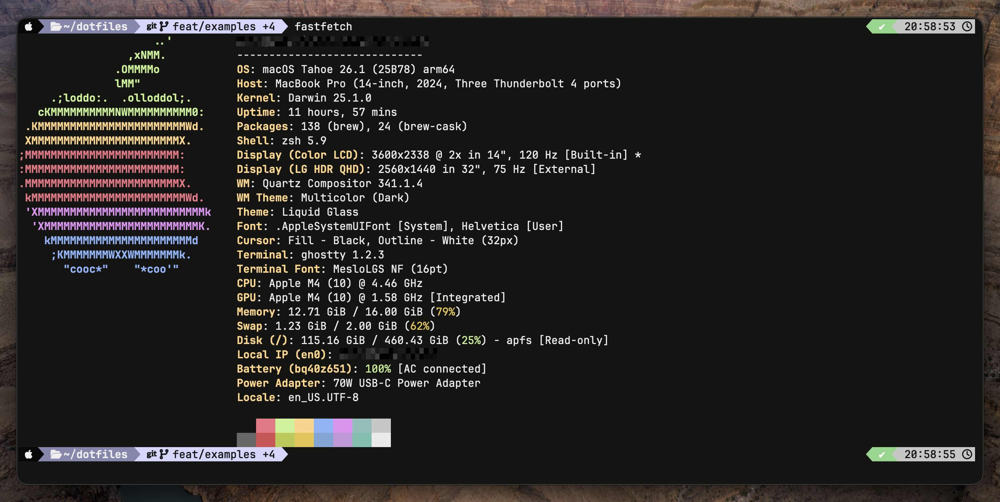

# Dotfiles



Personal dotfiles managed with [GNU Stow](https://www.gnu.org/software/stow/).
Cross-platform: **macOS**, **Arch Linux**, **Raspberry Pi OS / Debian**.

Goal: configurar un equipo nuevo de cero en menor tiempo posible — single-command bootstrap.

## Quickstart

### Vanilla machine (one-liner)

```bash
curl -fsSL https://raw.githubusercontent.com/feder1c0/dotfiles/main/scripts/bootstrap.sh | bash
```

### Pi / minimal (skip desktop + DevOps tools)

```bash
curl -fsSL https://raw.githubusercontent.com/feder1c0/dotfiles/main/scripts/bootstrap.sh | bash -s -- --minimal
```

### Already cloned

```bash
cd ~/dotfiles
./install.sh --full              # full install (default)
./install.sh --dry-run --full    # preview sin mutar
./install.sh --dotfiles          # solo stow (re-aplicar configs)
./install.sh --rollback          # revertir
```

## Soporte

| OS | Status | Package source |
|----|:------:|----------------|
| macOS (Apple Silicon + Intel) | ✓ | Homebrew |
| Arch Linux | ✓ | pacman + AUR (yay) |
| Raspberry Pi OS / Debian / Ubuntu | ✓ | apt + binary installers |

## Stow packages

| Package | Contenido |
|---------|-----------|
| `zsh` | `.zshrc`, `.p10k.zsh`, custom scripts |
| `tmux` | `.tmux.conf` |
| `ghostty` | terminal emulator config |
| `zed` | editor settings |
| `terraform` | `.terraformrc` |
| `i3` `picom` `polybar` `rofi` | Linux desktop (skip en `--minimal`) |

## Stow básico

```bash
cd ~/dotfiles

stow zsh              # crear symlinks
stow -R zsh           # restow (tras agregar archivos)
stow -D zsh           # remove symlinks
stow --simulate zsh   # preview

ls -d */ | xargs -n1 basename   # listar packages
```

Más detalle: [`docs/stow-reference.md`](docs/stow-reference.md).

## Contributing / modificar configs

> ⚠️ **Antes del primer commit**: instalar pre-commit hooks. Bloquean
> secrets (gitleaks), errores shell (shellcheck), formato (shfmt) y archivos
> grandes accidentales **antes** de que lleguen al remote.

### Setup automático

`./install.sh --full` (o `--dotfiles`) instala los hooks automáticamente al final
de la fase de dotfiles. Idempotente — re-run safe.

### Setup manual

```bash
cd ~/dotfiles
pre-commit install                          # hook pre-commit
pre-commit install --hook-type pre-push     # hook pre-push (defense-in-depth)
pre-commit run --all-files                  # smoke test inicial
```

Si `pre-commit` no está instalado: `brew install pre-commit` (macOS) /
`pacman -S pre-commit` (Arch) / `apt install pre-commit` (Debian/Pi).
Ya incluido en Brewfile + `packages/{arch,raspbian}.sh`.

### Hooks activos

| Hook | Bloquea |
|------|---------|
| `gitleaks` | API keys, tokens, credenciales |
| `shellcheck` | bugs en shell scripts (severity ≥ warning) |
| `shfmt` | formato shell inconsistente |
| `detect-private-key` | RSA/SSH/GPG private keys |
| `check-added-large-files` | archivos > 500 KB |
| `check-merge-conflict` | markers de conflict sin resolver |
| `trailing-whitespace`, `end-of-file-fixer`, `mixed-line-ending` | hygiene |

**No bypassear con `--no-verify`** — secrets en remote requieren rotación
manual incluso tras force-push (GitHub indexa/cachea).

CI weekly (`security.yml`) re-escanea history con rules nuevas. Layer secundario.

## Documentation

- [`docs/install.md`](docs/install.md) — install modes, flags, troubleshooting, idempotencia
- [`docs/stow-reference.md`](docs/stow-reference.md) — Stow commands + best practices + secrets
- [`docs/packages.md`](docs/packages.md) — matriz de paquetes per OS
- [`AGENTS.md`](AGENTS.md) — guidance para AI agents (Claude Code / Codex / Cursor / etc.)
- [`zsh/README.md`](zsh/.zsh/scripts/README.md) — shell scripts (brew-update, git-branch-cleanup)

## License

MIT. Provided as-is. No warranty.
