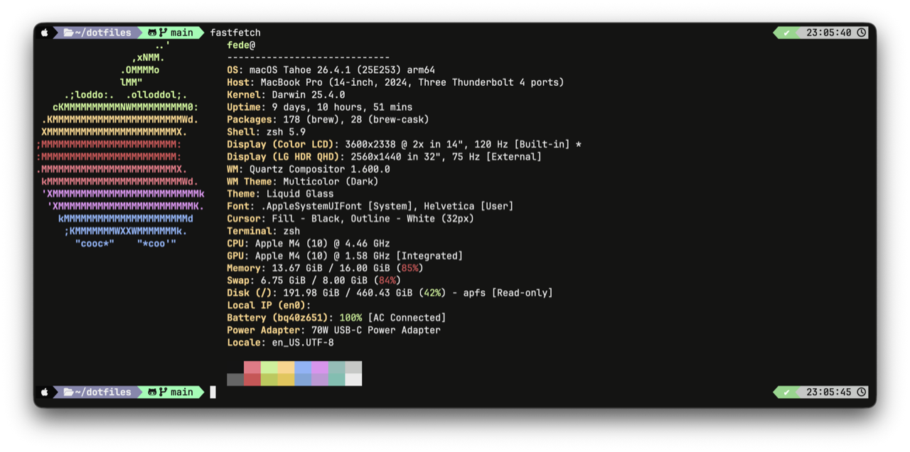

# Dotfiles



Personal dotfiles managed with [GNU Stow](https://www.gnu.org/software/stow/).
Cross-platform: **macOS**, **Arch Linux**, **Raspberry Pi OS / Debian**.

Single-command bootstrap from a vanilla machine to a fully provisioned shell + tooling environment.

## Quickstart

### Vanilla machine (one-liner)

```bash
curl -fsSL https://raw.githubusercontent.com/feder1c0/dotfiles/main/scripts/bootstrap.sh | bash
```

### Minimal (Pi / headless: skip desktop + DevOps tools)

```bash
curl -fsSL https://raw.githubusercontent.com/feder1c0/dotfiles/main/scripts/bootstrap.sh | bash -s -- --minimal
```

### Already cloned

```bash
cd ~/dotfiles
./install.sh --full              # default: packages + stow + shell
./install.sh --dry-run --full    # preview, no mutations
./install.sh --dotfiles          # re-stow only
./install.sh --rollback          # revert to last backup
```

## Support matrix

| OS | Status | Package source |
|----|:------:|----------------|
| macOS (Apple Silicon + Intel) | ✓ | Homebrew |
| Arch Linux | ✓ | pacman + AUR (yay) |
| Raspberry Pi OS / Debian / Ubuntu | ✓ | apt + binary installers |

## Stow packages

| Package | Contents |
|---------|----------|
| `zsh` | `.zshrc`, `.p10k.zsh`, custom scripts |
| `tmux` | `.tmux.conf` |
| `ghostty` | terminal emulator config |
| `zed` | editor settings |
| `terraform` | `.terraformrc` |
| `i3` `picom` `polybar` `rofi` | Linux desktop (skipped with `--minimal`) |

## Stow primer

```bash
cd ~/dotfiles

stow zsh              # create symlinks
stow -R zsh           # restow (after adding/removing files)
stow -D zsh           # remove symlinks
stow --simulate zsh   # preview

ls -d */ | xargs -n1 basename   # list packages
```

See [`docs/stow-reference.md`](docs/stow-reference.md) for conflict handling, `--adopt`, tree folding, and ignore patterns.

## Contributing

> ⚠️ **Install pre-commit hooks before the first commit.** They block secrets (gitleaks), shell bugs (shellcheck), formatting drift (shfmt), and accidental large files **before** they reach the remote.

### Automatic setup

`./install.sh --full` (or `--dotfiles`) installs hooks at the end of the dotfiles phase. Idempotent — safe to re-run.

### Manual setup

```bash
cd ~/dotfiles
pre-commit install                          # commit-time
pre-commit install --hook-type pre-push     # push-time (defense in depth)
pre-commit run --all-files                  # initial smoke test
```

If `pre-commit` is missing: `brew install pre-commit` (macOS) / `pacman -S pre-commit` (Arch) / `apt install pre-commit` (Debian/Pi). Already pinned in `Brewfile` + `packages/{arch,raspbian}.sh`.

### Active hooks

| Hook | Blocks |
|------|--------|
| `gitleaks` | API keys, tokens, credentials |
| `shellcheck` | shell bugs (severity ≥ warning) |
| `shfmt` | inconsistent shell formatting |
| `detect-private-key` | RSA/SSH/GPG private keys |
| `check-added-large-files` | files > 500 KB |
| `check-merge-conflict` | unresolved conflict markers |
| `trailing-whitespace`, `end-of-file-fixer`, `mixed-line-ending` | hygiene |

**Do not bypass with `--no-verify`.** A secret pushed to a remote requires credential rotation — force-push does not help (GitHub indexes and caches refs).

CI (`security.yml`) re-scans the full git history weekly against updated detection rules. Secondary layer.

## Documentation

- [`docs/install.md`](docs/install.md) — install modes, flags, idempotency, troubleshooting
- [`docs/stow-reference.md`](docs/stow-reference.md) — Stow commands, conflicts, secrets policy
- [`docs/packages.md`](docs/packages.md) — per-OS package matrix
- [`AGENTS.md`](AGENTS.md) — agent guidance ([agents.md](https://agents.md) standard)
- [`zsh/.zsh/scripts/README.md`](zsh/.zsh/scripts/README.md) — shell utilities (brew-update, git-branch-cleanup)

## License

MIT. Provided as-is, no warranty.
